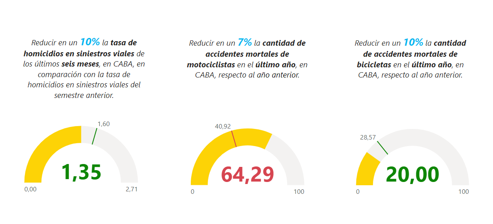

# <h1 align=center> **PROYECTO INDIVIDUAL N°2** </h1>
# <h2 align=center> ** Víctimas de Siniestros Viales en CABA ** </h2>

# <h2 align=center>**INTRODUCCION**</h2>

En este proyecto se simula el rol de un Data Analyst de una empresa consultora para la que el Observatorio de Movilidad y Seguridad Vial (OMSV), organismo que depende de la Secretaría de Transporte del Gobierno de la Ciudad Autónoma de Buenos Aires (CABA), le solicitó la elaboración de un proyecto de análisis de datos.

Como finalidad, se busca generar información que permita disminuir la cantidad de víctimas fatales de los siniestros viales ocurridos en CABA. Para ello, se pone a disposición un dataset sobre homicidios en siniestros viales de en la Ciudad de Buenos Aires durante el periodo 2016-2021.

Se espera como productos finales un reporte de las tareas realizadas, metodologías adoptadas y principales conclusiones y la presentación de un dashboard interactivo que facilite la interpretación de la información y su análisis.

# <h2 align=center>**CONTEXTO**</h2>

En Argentina, cada año mueren cerca de 4.000 personas en siniestros viales. Aunque muchas jurisdicciones han logrado disminuir la cantidad de accidentes de tránsito, esta sigue siendo la principal causa de muertes violentas en el país. Los informes del Sistema Nacional de Información Criminal (SNIC), del Ministerio de Seguridad de la Nación, revelan que entre 2018 y 2022 se registraron 19.630 muertes en siniestros viales en todo el país. Estas cifras equivalen a 11 personas por día que resultaron víctimas fatales por accidentes de tránsito.

Solo en 2022, se contabilizaron 3.828 muertes fatales en este tipo de hechos. Los expertos en la materia indican que en Argentina es dos o tres veces más alta la probabilidad de que una persona muera en un siniestro vial que en un hecho de inseguridad delictiva.

La Ciudad Autónoma de Buenos Aires, que se ubica en la provincia de Buenos Aires en Argentina, no es la excepción a esta problemática, sino que los siniestros viales son una preocupación importante debido al alto volumen de tráfico y la densidad poblacional. Estos incidentes pueden tener un impacto significativo en la seguridad de los residentes y visitantes de la ciudad, así como en la infraestructura vial y los servicios de emergencia.

Actualmente, según el censo poblacional realizado en el año 2022, la población de CABA es de 3,120,612 de habitantes en una superficie de 200 km2, lo que implica una densidad de aproximadamente 15,603 hab/km2 <a href=https://www.argentina.gob.ar/caba#:~:text=Poblaci%C3%B3n%3A%203.120.612%20habitantes%20(Censo%202022).>(Fuente)</a>. Sumado a esto, el Julio de 2023 se registraron 12,437,735 de vehículos transitando por los peajes de las autopistas de acceso a CABA <a href=https://www.estadisticaciudad.gob.ar/eyc/?p=41995.>(Fuente)</a>. Por lo que la prevención de siniestros viales y la implementación de políticas efectivas son esenciales para abordar este problema de manera adecuada.

# <h2 align=center>**DATOS**</h2>

Para este proyecto se trabajó con la Bases de Víctimas Fatales en Siniestros Viales que se encuentra en formato de Excel y contiene dos pestañas de datos:

* HECHOS: que contiene una fila de hecho con id único y las variables temporales, espaciales y participantes asociadas al mismo.
* VICTIMAS: contiene una fila por cada víctima de los hechos y las variables edad, sexo y modo de desplazamiento asociadas a cada víctima. 

Se vincula a los HECHOS mediante el id del hecho.

Tales datos fueron extraídos del siguiente <a href=https://data.buenosaires.gob.ar/dataset/victimas-siniestros-viales>link</a> del Gobierno de la Ciudad de Buenos Aires
y en este <a href=https://github.com/leoviscay/PI2_Siniestros-Viales/blob/main/data/NOTAS_HOMICIDIOS_SINIESTRO_VIAL.pdf>documento</a> se detallan todas las definiciones manejadas en los datos y en el desarrollo de este proyecto. 

# <h2 align=center>**ETL y EDA**</h2>
<h4 align=center>(Extracción, Transformación y Carga de Datos) y (Análisis Exporatorio de Datos)</h4>

En este proyecto se utilizó Python y Pandas para los procesos de extracción, transformación y carga de los datos, como así también para el análisis exploratorio de los datos. En el siguiente apartado se describen los resultados del análisis.

Luego, para la obtención complementaria de datos para el cálculo de la población en el año 2021 se realizó webscraping utilizando la librería BeautifulSoup. Este proceso puede visualizarse en el siguiente <a href=<a href=https://github.com/leoviscay/PI2_Siniestros-Viales/blob/main/data/NOTAS_HOMICIDIOS_SINIESTRO_VIAL.pdf>documento</a>.

<h4>ETL</h4>

En primer lugar, se realizó un proceso de extracción, transformación y carga de los datos (ETL), tanto de "HECHOS" como "VÍCTIMAS", donde se estandarizaron nombres de las variables, se analizaron nulos y duplicados de los registros, se eliminaron columnas redundantes o con muchos valores faltantes, entre otras tareas. Una vez finalizado este proceso para los dos conjuntos de datos de "Homicidios" se procedió a unir los dos conjuntos en uno solo denominado df_homicidios.

En segundo lugar, se procedió a realizar un análisis exploratorio exahustivo (EDA), con la finalidad de encontrar patrones que permitan generar información que le permita a las autoridades locales tomar medidas para disminuir la cantidad de víctimas fatales de los siniestros viales. Todos los detalles de este análisis se encuentran <a href=https://github.com/leoviscay/PI2_Siniestros-Viales/blob/main/jupyter/ETL%20_EDA_Homicidios.ipynb>aquí</a>.

Finalmente, para la construcción de un dashboard interactivo se utiliza Power BI, el cuál se puede consultar <a href=https://github.com/leoviscay/PI2_Siniestros-Viales/blob/main/Dashboard_PI2.pbix>aquí</a> o accediendo desde el siguiente QR a PowerBi:

<h4>EDA</h4>

En primer instancia, se analizó fue variable temporal, para entender la distribución de los homicidios en distintas escalas temporales. La distribución anual de la cantidad de víctimas fatales es de alrededor del 60% para los primeros 3 años del conjunto de datos, con una disminución marcada para el 2020 como consecuencia de la cuarentena por COVID 19. El comportamiento a lo largo del año, es decir, la variación mensual, si bien para todo el conjunto de datos es marcada, con un pico de víctimas en Diciembre, esta tendencia no se observa tan claramente entre los distintos años. Este resultado de la mayor cantidad de víctimas en Diciembre está influenciada por la flexibilización de las medidas tomadas por la cuarentena.

Luego, bajando en la escala temporal, se ve que el 70% de las victimas perdieron la vida en entre lunes y viernes, lo que haría pensar que se debe al traslado diario al trabajo, pero en la distribución semanal no se observan diferencias significativas entre los distintos días. Es decir, la cantidad de víctimas un sábado o un domingo, para todo el conjunto de datos, es aproximadamente el mismo.

Si se analizan las franjas horarias, la mayor cantidad de víctimas, se presentaron en el horario entre las 6 a 8 de la mañana, lo que también hace pensar en el horario de ingreso a los trabajos. Pero si se analiza esta franja en particular, se observa que más de la mitad de las víctimas se registraron en hechos ocurridos durante el fin de semana.

Lo siguiente que se hizo fue analizar el perfil de la víctima. En primero lugar se ve que el 77% de las víctimas son masculinas. Y en cuanto al rol de la víctima, es decir la posición relativa que ocupaba al momento del hecho, el 48% era conductor. En particular, este 48% se distribuye en un 77% de víctimas que se movilizaban en moto y 19% en auto. En relación a la cantidad de víctimas según el medio de transporte al momento del hecho, el 42% de las víctimas son conductores de moto, de los cuales el 88% de los conductores de moto son masculino.

Asimismo, si se analiza la responsabilidad en el hecho, es decir, el vehículo que ocupaba quien resultó acusado, en el 29% de los casos fue el auto, pero en el 75% son responsabilidad de vehículos como auto, colectivos y camiones.

# <h2 align=center>**KPI'S**</h2>

En función del EDA, se plantearon tres objetivos en relación a la disminución de la cantidad de víctimas fatales de los siniestros viales, desde los cuales se proponen tres indicadores de rendimiento clave o KPI.

# <h4>  Reducir en un 10% la tasa de homicidios en siniestros viales de los últimos seis meses, en CABA, en comparación con la tasa de homicidios en siniestros viales del semestre anterior </h4>

Las tasas de mortalidad relacionadas con siniestros viales suelen ser un indicador crítico de la seguridad vial en una región. Se define como Tasa de homicidios en siniestros viales al número de víctimas fatales en accidentes de tránsito por cada 100,000 habitantes en un área geográfica durante un período de tiempo específico, en este caso se toman 6 meses. Su fórmula es:

Como Población Total se calculó la población para el año 2021 a partir de los censos poblacionales del año 2010 y 2022.

En este caso, para el año 2021, la Tasa de homicidios en siniestros viales fue de 1.77 lo que significa que, durante los primeros 6 meses del año 2021, hubo aproximadamente 1.77 homicidios en accidentes de tránsito por cada 100,000 habitantes. Ahora, el objetivo planteado es reducir esta tasa para el siguiente semestre de 2021 en un 10%, esto es 1.60. 

Cuando se calcula el KPI para este período se obtiene que la Tasa de homicidios en siniestros viales fue de 1.35, lo que significa que para el segundo semestre de 2021 se cumple con el objetivo propuesto.

# <h4> Reducir en un 7% la cantidad de accidentes mortales de motociclistas en el último año, en CABA, respecto al año anterior </h4>

En este caso se define a la Cantidad de accidentes mortales de motociclistas como el número absoluto de accidentes fatales en los que estuvieron involucradas víctimas que viajaban en moto en un determinado periodo temporal. La fórmula para medir la evolución de los accidentes mortales con víctimas en moto es:

Aquí, se toma como año actual al año 2021 y como año anterior al año 2020. En primer lugar, se calculó la Cantidad de accidentes mortales de motociclistas para el año 2020, el cual resultó de -44.00, de esta manera el objetivo a cumplir es de -40.92 (es decir, la reducción del 7% de la cantidad de accidentes para 2020). El calcular la Cantidad de accidentes mortales de motociclistas para el año 2021 resultó de 64.29, lo que significa que aumentó un 64% la cantidad de muertes de conductores de motociclistas respecto del 2021.

# <h4> Reducir en un 10% la cantidad de accidentes mortales de ciclistas en el último año, en CABA, respecto al año anterior </h4>

En este caso se define a la Cantidad de accidentes mortales de ciclistas como el número absoluto de accidentes fatales en los que estuvieron involucradas víctimas que vse trasladaban en bici en un determinado periodo temporal. La fórmula para medir la evolución de los accidentes mortales con víctimas en bicicleta es:

Aquí, se toma como año actual al año 2021 y como año anterior al año 2020. En primer lugar, se calculó la Cantidad de accidentes mortales de ciclistas para el año 2020, el cual resultó de 31.74, de esta manera el objetivo a cumplir es de 28.57 (es decir, la reducción del 10% de la cantidad de accidentes para 2020). El calcular la Cantidad de accidentes mortales de motociclistas para el año 2021 resultó de 20.00, lo que significa que decreció un 37% la cantidad de muertes de ciclistas respecto del 2021.

Puede verse un resúmen en la siguiente imágen:

# <h2 align=center>**CONCLUSIONES Y RECOMENDACIONES**</h2>

Entre los años 2016 a 2021 se registraron 717 víctimas fatales en accidentes de tránsito, en su mayoría resultaron durante los días de semana y fue Diciembre es el mes que resulta con el máximo de fallecimientos en el período analizado.

El 77% de las víctimas fatales fueron de sexo masculino. En relación al tipo de usuario, el casi la mitad fueron motociclistas. 

Finalmente, para el segundo semestre del año 2021, se cumplió con el objetivo de bajar la tasa de homicidios en siniestros viales, y la reduccion de victimas en siniestros con ciclistas en 2021, respecto al 2020; pero no se cumplió con el objetivo de reducir la cantidad de accidentes mortales en motociclistas.

En función de lo anterior, se hacen las siguientes recomendaciones:

* Continuar monitoreando los objetivos propuestos acompañados de campañas puntuales.
* Continuar con los trabajos en bicisendas
* Reforzar las campañas de seguridad vial entre los días viernes a lunes, intensificando particularmente en el mes de Diciembre y las horas "pico"
* Dirigir las campañas de seguridad hacia el sexo masculino, especialmente en cuanto a conducción en moto.

# <h2 align=center>**Información adicional**</h2>

Se utilizó la escala cromática y logos del gobierno de la ciudad de Buenos Aires que pueden visualizarse <a href=<a href=https://github.com/leoviscay/PI2_Siniestros-Viales/blob/main/data/Manual%20GCBA%20Versi%C3%B3n%20Final..pdf>aquí</a>.

